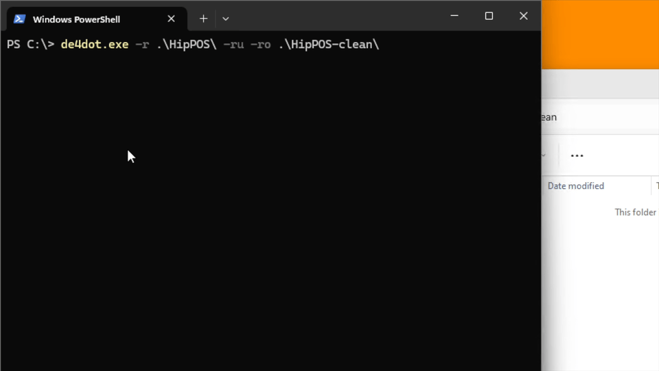
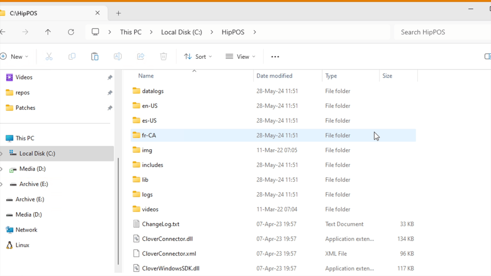
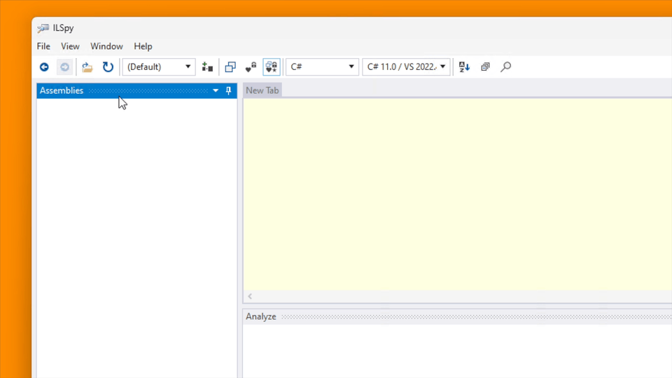
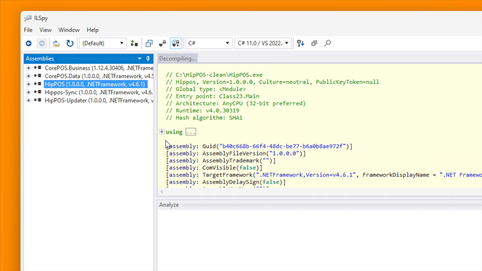
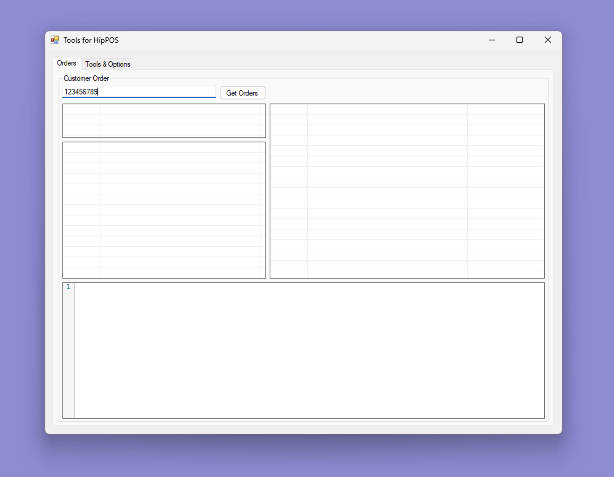

# Reverse Engineering Case Study: HipPOS Hidden API

How to discover HipPOS app hidden API by peeking at the source code.

## Background

My client needed to find the hidden API within the HipPOS desktop app to use for their own web app. Here's how I uncovered it.

## Tools

- [de4dot](https://github.com/de4dot/de4dot): .NET de-obfuscator and unpacker
- [ILSpy](https://github.com/icsharpcode/ILSpy): .NET decompiler
- [Visual Studio Code](https://code.visualstudio.com)
- [Visual Studio](https://visualstudio.microsoft.com)

## Step 1: Deobfuscate the Binaries

First, I detected if the binaries were protected by an obfuscator.



Using de4dot, I identified that the binaries were protected by .NET Reactor.

```shell
$ de4dot.exe -d -r .\HipPOS\

de4dot v3.1.41592.3405

Detected .NET Reactor (C:\HipPOS\CorePOS.Business.dll)
Detected .NET Reactor (C:\HipPOS\CorePOS.Data.dll)
Detected .NET Reactor (C:\HipPOS\Hippos-Sync.exe)
Detected .NET Reactor (C:\HipPOS\HipPOS-Updater.exe)
Detected .NET Reactor (C:\HipPOS\HipPOS.exe)
```

I then cleaned the binaries.

```shell
$ de4dot.exe -r .\HipPOS\ -ru -ro .\HipPOS-clean\

de4dot v3.1.41592.3405

Detected .NET Reactor (C:\HipPOS\CorePOS.Business.dll)
Detected .NET Reactor (C:\HipPOS\CorePOS.Data.dll)
Detected .NET Reactor (C:\HipPOS\Hippos-Sync.exe)
Detected .NET Reactor (C:\HipPOS\HipPOS-Updater.exe)
Detected .NET Reactor (C:\HipPOS\HipPOS.exe)
Cleaning C:\HipPOS\CorePOS.Business.dll
Cleaning C:\HipPOS\CorePOS.Data.dll
Cleaning C:\HipPOS\Hippos-Sync.exe
Cleaning C:\HipPOS\HipPOS-Updater.exe
Cleaning C:\HipPOS\HipPOS.exe
Renaming all obfuscated symbols
Saving C:\HipPOS-clean\CorePOS.Business.dll
Saving C:\HipPOS-clean\CorePOS.Data.dll
Saving C:\HipPOS-clean\Hippos-Sync.exe
Saving C:\HipPOS-clean\HipPOS-Updater.exe
Saving C:\HipPOS-clean\HipPOS.exe
```

## Step 2: Decompile the Binaries and Retrieve the C# Source Code

Next, I copied all `dll` libraries from `C:\HipPOS\` to `C:\HipPOS-clean\`, ensuring not to replace the deobfuscated binaries.



I opened ILSpy, selected the necessary files, and saved the source code.

- CorePOS.Business.dll
- CorePOS.Data.dll
- Hippos-Sync.exe
- HipPOS-Updater.exe
- HipPOS.exe



For each binary, I right-clicked and selected **Save Code**.



I saved the code to `C:\HipPOS-src\`.

## Step 3: Find Hidden REST API

Using Visual Studio Code, I searched for `hipposhq.com` within the project files and found the classes and functions that use REST API calls.

## Step 4: Build a Simple WinForms App to Test HipPOS REST API

I built a simple desktop app to verify if I used the correct functions.

It was a basic GUI with functions copied from the decompiled code from Steps 2 and 3.

~

## Step 5: Write Python Script for Web App Integration with HipPOS REST API

Once the REST API was verified, I wrote a Python script to integrate with the client's web app.

The end result can be seen in [src/python-cli](https://github.com/junian/windows-pos-re/tree/master/src/python-cli).
